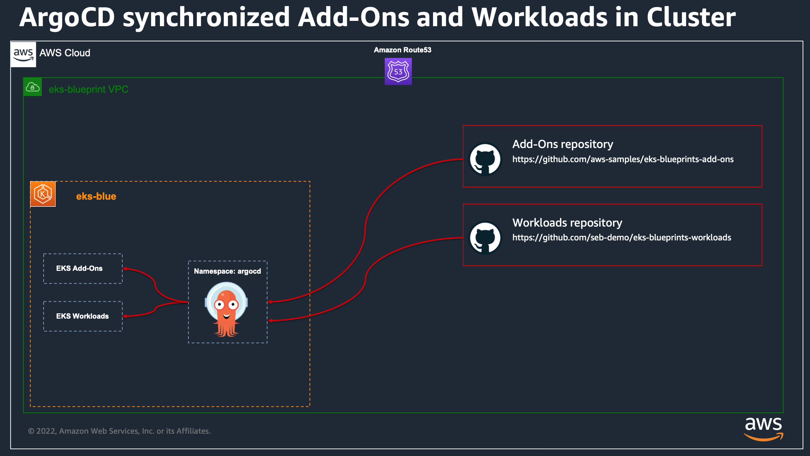
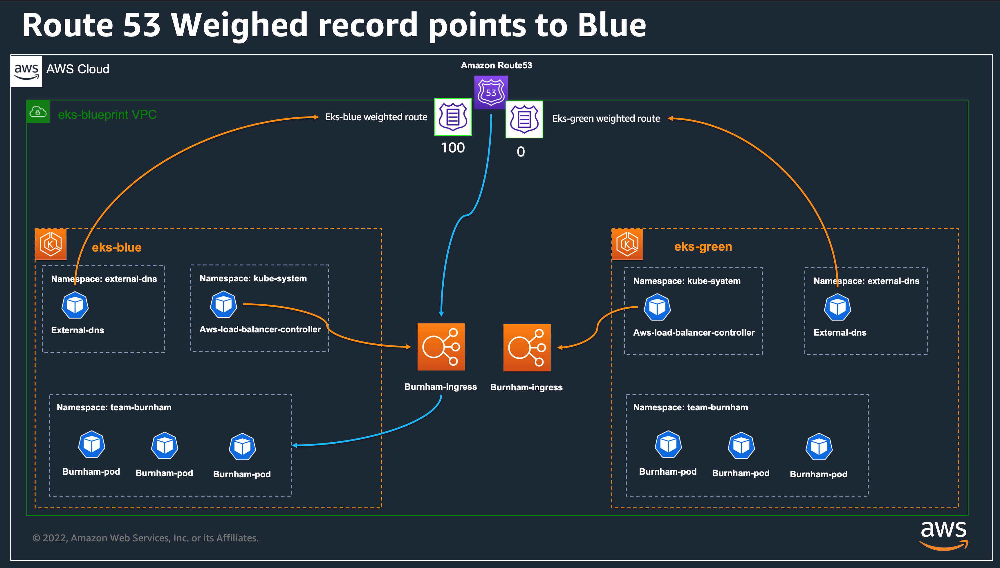
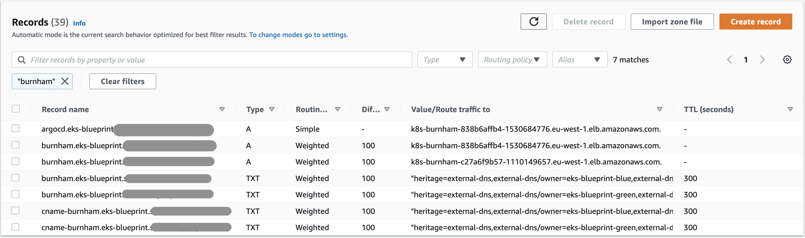
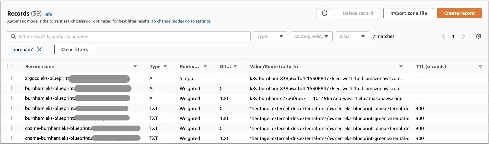
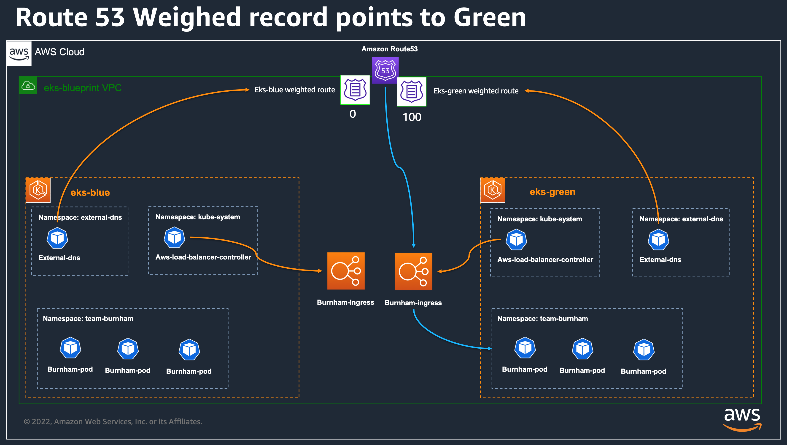

# EKS Blueprint for Terraform - Sample for blue/green cluster migration

This directory provide a pattern based on [EKS Blueprint for Terraform](https://aws-ia.github.io/terraform-aws-eks-blueprints) that show how to leverage blue/green or canary application workload migration between EKS clusters, using [Amazon Route 53](https://docs.aws.amazon.com/Route53/latest/DeveloperGuide/routing-policy-weighted.html) weighted routing with [AWS LoadBalancer Controller](https://aws-ia.github.io/terraform-aws-eks-blueprints/v4.13.0/add-ons/aws-load-balancer-controller/) and [External DNS add-on](https://aws-ia.github.io/terraform-aws-eks-blueprints/v4.13.0/add-ons/external-dns/).

We are leveraging [the existing EKS Blueprints Workloads GitHub repository](https://github.com/aws-samples/eks-blueprints-workloads) to deploy our GitOps [ArgoCD](https://aws-ia.github.io/terraform-aws-eks-blueprints/v4.13.0/add-ons/argocd/) workloads, which are defined as helm charts. We are leveraging [ArgoCD Apps of apps](https://argo-cd.readthedocs.io/en/stable/operator-manual/cluster-bootstrapping/) pattern where an ArgoCD Application can also reference other ArgoCD Applications.

> **Note**: Currently we need this [PR](https://github.com/aws-samples/eks-blueprints-workloads/pull/22) to be merged for this demo. in the meantime, we configured the `terraform.tfvars.example` to use the soruce of this PR repo so that the example will work.

See the Architecture of what we are building

<p align="center">
  
</p>

## Table of content

- [EKS Blueprint for Terraform - Sample for blue/green cluster migration](#eks-blueprint-for-terraform---sample-for-bluegreen-cluster-migration)
  - [Table of content](#table-of-content)
  - [Prerequisites](#prerequisites)
  - [Quick Start](#quick-start)
    - [Configure the Stacks](#configure-the-stacks)
    - [Create the core stack](#create-the-core-stack)
    - [Create the Blue cluster](#create-the-blue-cluster)
    - [Create the Green cluster](#create-the-green-cluster)
  - [See our Workload: focus on team-burnham deployment.](#see-our-workload-focus-on-team-burnham-deployment)
  - [Using AWS Route53 and External DNS](#using-aws-route53-and-external-dns)
    - [Configure Ingress ressources with weighted records](#configure-ingress-ressources-with-weighted-records)
    - [Automate the migration from Terraform](#automate-the-migration-from-terraform)
  - [Delete the Stack](#delete-the-stack)
    - [Delete the EKS Cluster(s)](#delete-the-eks-clusters)
    - [Delete the core infra stack](#delete-the-core-infra-stack)
  - [Troubleshoot](#troubleshoot)
    - [External DNS Ownership](#external-dns-ownership)
    - [Check Route 53 Record status](#check-route-53-record-status)
    - [Check current resolution and TTL value](#check-current-resolution-and-ttl-value)

## Prerequisites

- [Terraform](https://learn.hashicorp.com/tutorials/terraform/install-cli) (tested version v1.2.9 on linux)
- [Git](https://github.com/git-guides/install-git)
- [AWS CLI](https://docs.aws.amazon.com/cli/latest/userguide/getting-started-install.html#getting-started-install-instructions)
- AWS test account with administrator role access

## Quick Start

### Configure the Stacks

For working with this repository, you will need an existing [Amazon Route 53](https://docs.aws.amazon.com/route53/index.html) Hosted Zone, in which the blueprint will be able to create based on the `core_stack_name` parameter a dedicated Hosted Zone that will store the records for our workloads.

Before moving to the next step, you will need to register a parent domain with [Amazon Route 53](https://docs.aws.amazon.com/route53/index.html) (https://docs.aws.amazon.com/Route53/latest/DeveloperGuide/domain-register.html) in case you don’t have one created yet.

You will need to provide the `hosted_zone_name` for example `my-example.com` and then the domain for your workloads will be on `${core_stack_name}.${hosted_zone_name}` so in our example `eks-blueprint.my-example.com`

First, copy the configuration file, and fill with appropriate values:

```
cp terraform.tfvars.example terraform.tfvars
```

Our sample is composed of three main directory:

- _core-infra_ → this stack will create vpc and dependencies, create a Route53 sub zone for our sample, and a wildcard Certificate Manager certificate for our applications TLS endpoints, and a SecretManager password for the ArgoCD UIs.
- _eks-blue_ → will create our Blue EKS blueprint cluster, with ArgoCD add-on which will automatically deploy additional add-ons and our demo workloads
- _eks-green_ → same as blue, with some configuration differences (that can be newer Kubernetes version)

So we are going to create 2 EKS clusters, sharing the same VPC, and each one of them will install locally our workloads from the central GitOps repository leveraging ArgoCD add-on.
In the GitOps workload repository, we have configured our applications deployments to leverage AWS Load Balancers Controllers annotations, so that applications will be exposed on AWS Load Balancers, created from our Kubernetes manifests. We will have 1 load balancer per cluster for each of our applications.

We have configured ExternalDNS add-ons in our two clusters to share the same Route53 Hosted Zone. The workloads in both clusters also share the same Route 53 DNS records, and we can either configure the eks-blue or eks-green to own the records, allowing us to do blue/green migration, or preferably we can rely on AWS Route53 weighted records to allow us to configure canary workload migration between our two clusters.

Here we uses the same GitOps workload configuration and adapts parameters with the `values.yaml`, but we could also uses another ArgoCD repository, or uses a new directory if we want to validate or test new deployment manifests with maybe additional features or configurations or to use with different Kubernetes add-ons (like changing ingress controller).

Our objective here is to show you how Application teams and Platform teams can configured the infrastructure so that application teams are able to deploy seamlessly their workloads to the EKS clusters thanks to ArgoCD, and platform team can keep the control of migrating production workflow from one cluster to another without having to synchronized operations with applications teams.

> In this example we show how you can seamlessly migrate your stateless workloads between the 2 clusters for a blue/green or Canary migration, but you can also leverage the same architecture to have your workloads for example separated in different accounts or regions, for either High Availability or Lower latency Access from your customers.

### Create the core stack

```bash
cd core-infra
terraform init
terraform apply
```

### Create the Blue cluster

```bash
cd eks-blue
terraform init
terraform apply
```

### Create the Green cluster

```bash
cd eks-green
terraform init
terraform apply
```

By default the only differences in the 2 clusters are the values defined in `locals.tf`. We will change thoses values to for upgrade of clusters, and to migrate our stateless workloads between clusters.

## See our Workload: focus on team-burnham deployment.

Our clusters are configured with existing ArgoCD Github repository that will be synchronized using ArgoCD into each of the clusters:

- [EKS Blueprints Add-ons repository](https://github.com/aws-samples/eks-blueprints-add-ons)
- [Workloads repository](https://github.com/seb-tmp/eks-blueprints-workloads/tree/blue-green-demo)

<p align="center">
  
</p>

We are going to look after on of the application deployed from the workload repository as example to demonstrate our migration automation: the `Burnham` workload in the team-burnham namespace.
We have set up a [simple go application](https://github.com/allamand/eks-example-go) than can respond in it's body the name of the cluster it is running on. With this it will be easy to see the current migration on our workload.

```
<head>
  <title>Hello EKS Blueprint</title>
</head>
<div class="info">
  <h>Hello EKS Blueprint Version 1.4</h>
  <p><span>Server&nbsp;address:</span> <span>10.0.2.201:34120</span></p>
  <p><span>Server&nbsp;name:</span> <span>burnham-9d686dc7b-dw45m</span></p>
  <p class="smaller"><span>Date:</span> <span>2022.10.13 07:27:28</span></p>
  <p class="smaller"><span>URI:</span> <span>/</span></p>
  <p class="smaller"><span>HOST:</span> <span>burnham.eks-blueprint.mon-domain.com</span></p>
  <p class="smaller"><span>CLUSTER_NAME:</span> <span>eks-blueprint-blue</span></p>
</div>
```

The application is deployed from our [<burnham> workload repository manifest](https://github.com/seb-tmp/eks-blueprints-workloads/blob/blue-green-demo/teams/team-burnham/dev/templates/burnham.yaml)

See the deployment

```bash
$ kubectl get deployment -n team-burnham -l app=burnham-deployment-devburnham
NAME      READY   UP-TO-DATE   AVAILABLE   AGE
burnham   3/3     3            3           3d18h
```

See the pods

```bash
$ kubectl get pods -n team-burnham -l app=burnham
NAME                       READY   STATUS    RESTARTS   AGE
burnham-7db4c6fdbb-82hxn   1/1     Running   0          3d18h
burnham-7db4c6fdbb-dl59v   1/1     Running   0          3d18h
burnham-7db4c6fdbb-hpq6h   1/1     Running   0          3d18h
```

See the logs:

```bash
$ kubectl logs -n team-burnham -l app=burnham
2022/10/10 12:35:40 {url: / }, cluster: eks-blueprint-blue }
2022/10/10 12:35:49 {url: / }, cluster: eks-blueprint-blue }
```

You can make a request to the service, and filter the output to know on which cluster it runs:

```bash
$ URL=$(echo -n "https://" ; kubectl get ing -n team-burnham burnham-ingress -o json | jq ".spec.rules[0].host" -r)
$ curl -s $URL | grep CLUSTER_NAME | awk -F "<span>|</span>" '{print $4}'
eks-blueprint-blue
```

## Using AWS Route53 and External DNS

We have configured both our clusters to configure the same [Amazon Route 53](https://aws.amazon.com/fr/route53/) Hosted Zones. This is done by having the same configuration of [ExternalDNS](https://github.com/kubernetes-sigs/external-dns) add-on in `main.tf`:

> **Note:**: In order to work, we need the [PR 1035](https://github.com/aws-ia/terraform-aws-eks-blueprints/pull/1035) to be merged

This is the Terraform configuration to configure ExternalDNS Add-on (it will be deployed with ArgoCD)

```
  enable_external_dns = true

  external_dns_helm_config = {
    txtOwnerId         = local.name
    zoneIdFilter       = data.aws_route53_zone.sub.zone_id
    policy             = "sync"
    awszoneType        = "public"
    zonesCacheDuration = "1h"
    logLevel           = "debug"
  }
```

We use ExternalDNS in `sync` mode so that the controller can create but also remove DNS records accordingly to service or ingress objects creation.
We also configured the `txtOwnerId` with the name of the cluster, so that each controller will be able to create/update/delete records but only for records which are associated to the proper OwnerId.
Each Route53 record will be also associated with a `txt` record. This record is used to specify the owner of the associated record and is in the form of:

```
"heritage=external-dns,external-dns/owner=eks-blueprint-blue,external-dns/resource=ingress/team-burnham/burnham-ingress"
```

So in this example the Owner is the external-dns controller, from the eks-blueprint-blue EKS cluster, and correspond to the Kubernetes ingress ressouce names burnham-ingress in the team-burnham namespace.

Using this feature, and relying on weighted records, we will be able to do blue/green or canary migration by changing the weight of ingress ressources defined in each cluster.

### Configure Ingress ressources with weighted records

Since we have configured ExternalDNS add-on, we can now defined specific annotation in our `ingress` object. You may already know that our workload are synchronized using ArgoCD from our workload repository sample.

We are focusing on the burnham deployment, which is defined in : https://github.com/seb-demo/eks-blueprints-workloads/tree/main/teams/team-burnham/dev/templates

in `burnham.yaml`, in the `burnham-ingress` ingress object

```
    external-dns.alpha.kubernetes.io/set-identifier: {{ .Values.spec.clusterName }}
    external-dns.alpha.kubernetes.io/aws-weight: '{{ .Values.spec.ingress.route53_weight }}'
```

We rely on two external-dns annotation to configure how the record will be created. the `set-identifier` annotation will contain the name of the cluster we want to create, which must match the one define in the external-dns `txtOwnerId` configuration.

the `aws-weight` will be used to configure the value of the weighted record, and it will be deployed from Helm values, that will be injected by Terraform in our example, so that our platform team will be able to control autonomously how and when they want to migrate workloads between the EKS clusters.

Amazon Route 53 weighted records works like this:

- If we specify a value of 100 in eks-blue cluster and 0 in eks-green cluster, then Route 53 will route requests to 100/(100+0) = 1, so all records will be on eks-blue cluster.
- If we specify a value of 0 in eks-blue cluster and 0 in eks-green cluster, then Route 53 will route requests to 0/(0+100)=0 on eks-blue and 100/0+100)=0 on eks-green, so all records will be on eks-green cluster.
- we can also define any intermediate values like 100 in eks-blue cluster and 100 in eks-green cluster, then Route 53 will route requests to 100/(100+100)=0,5 on eks-blue and 100/100+100)=0 on eks-green, so we will have 50% on eks-blue and 50% on eks-green.

### Automate the migration from Terraform

Now that we have setup our 2 clusters, deployed with ArgoCD and that the weighed records from `values.yaml` are injected from Terraform, let's see how our Platform team can trigger the workload migration.

1. At first, 100% of burnham traffic is set to the **eks-blue** cluster, this is controlled from the `locals.tf` with the parameter `route53_weight = "100"`. The same parameter is set to 0 in cluster eks-green.

<p align="center">
  
</p>
  Which correspond to :
<p align="center">
  
</p>

All requests to our endpoint should response with `eks-blueprint-blue` we can test it with the following command:

```
$ URL=$(echo -n "https://" ; kubectl get ing -n team-burnham burnham-ingress -o json | jq ".spec.rules[0].host" -r)
$ curl -s $URL | grep CLUSTER_NAME | awk -F "<span>|</span>" '{print $4}'
eks-blueprint-blue
```

2. Let's change traffic to 50% eks-blue and 50% eks-green by activating also value 100 in **eks-green** locals.tf (`route53_weight = "100"`) and let's `terraform apply` to let terraform update the configuration

<p align="center">
  
</p>
  Which correspond to :
<p align="center">
  
</p>

All records have weight of 100, so we will have 50% requests on each clusters.

We can check the ratio of requests resolution between both clusters

```
URL=$(echo -n "https://" ; kubectl get ing -n team-burnham burnham-ingress -o json | jq ".spec.rules[0].host" -r)
repeat 10 curl -s $URL | grep CLUSTER_NAME | awk -F "<span>|</span>" '{print $4}' && sleep 60
```

The default TTL is for 60 seconds, and you have 50% chance to have blue or green cluster, then you may need to replay the previous command several times to have an idea of the repartition, which theorically is 50%

3. Now that we see that our green cluster is taking requests correctly, we can update the eks-blue cluster configuration to have the weight to 0 and apply again. after a few moment, your route53 records should look like the below screenshot, and all requests should now reach eks-green cluster.

<p align="center">
  
</p>
  Which correspond to :
<p align="center">
  
</p>

At this step, all the traffic is now coming on the eks-green cluster. You can either, delete the eks-blue cluster, or decide to make upgrades on the green cluster and send back traffic on eks-blue afterward, or simply keep it as possibility of rollback if needed.

In this example, we uses a simple terraform variable to control the weight for 1 application, we could also use 1 var to controll weight for all applications deployed in the cluster, or we can also choose to have several parameters, let's say one per application, so you can finer control your migration strategy application by application.

## Delete the Stack

### Delete the EKS Cluster(s)

> This section, can be executed in either eks-blue or eks-green folders, or in both if you want to delete both clusters.

In order to properly destroy the Cluster, we need first to remove the ArgoCD workloads, while keeping the ArgoCD addons.

Why doing this ? when we remove an ingress object, we want the associated Kubernetes add-ons like aws load balancer controller and External DNS to freed correctly associated AWS ressources. If we directly ask terraform to destroy everything, it can remove first theses controllers without letting them the time to remove associated aws ressources that will be still existing in AWS, preventing us to clean completely our VPC.

```bash
kubectl delete application workloads -n argocd
```

Once every workload as been freed on AWS side, (this can take some times), we can then destroy our add-ons and terraform ressources

> Note: it can take time to deregister all load balancers, verify that you don't have any more AWS ressources created by EKS prior to start destroying EKS with terraform.

```bash
terraform apply -destroy -target="module.kubernetes_addons" -auto-approve
terraform apply -destroy -target="module.eks_blueprints" -auto-approve
terraform apply -destroy -auto-approve
```

### Delete the core infra stack

If you have finish playing with this solution, and once you have destroyed the 2 EKS clusters, you can now delete the core_infra stack.

```
cd core-infra
terraform apply -destroy -auto-approve
```

This will destroy the Route53 hosted zone, the Certificate manager certificate, the VPC with all it's associated ressources.

## Troubleshoot

### External DNS Ownership

The Amazon Route 53 records association are controlled by ExternalDNS controller. You can see the logs from the controller to understand what is happening by executing the following command in each cluster:

```
kubectl logs  -n external-dns -l app.kubernetes.io/name=external-dns -f
```

In eks-blue cluster, you can see logs like the following, which showcase that the eks-blueprint-blue controller won't make any change in records owned by eks-blueprint-green cluster, the reverse is also true.

```
time="2022-10-10T15:46:54Z" level=debug msg="Skipping endpoint skiapp.eks-blueprint.sallaman.people.aws.dev 300 IN CNAME eks-blueprint-green k8s-riker-68438cd99f-893407990.eu-west-1.elb.amazonaws.com [{aws/evaluate-target-health true} {alias true} {aws/weight 100}] because owner id does not match, found: \"eks-blueprint-green\", required: \"eks-blueprint-blue\""
time="2022-10-10T15:46:54Z" level=debug msg="Refreshing zones list cache"
```

### Check Route 53 Record status

We can also use the CLI to see our current Route 53 configuration:

```bash
export ROOT_DOMAIN=<your-domain-name> # the value you put in core_stack_name
ZONE_ID=$(aws route53 list-hosted-zones-by-name --output json --dns-name "eks-blueprint.${ROOT_DOMAIN}." --query "HostedZones[0].Id" --out text)
echo $ZONE_ID
aws route53 list-resource-record-sets \
  --output json \
  --hosted-zone-id $ZONE_ID \
  --query "ResourceRecordSets[?Name == 'burnham.eks-blueprint.$ROOT_DOMAIN.']|[?Type == 'A']"

aws route53 list-resource-record-sets \
  --output json \
  --hosted-zone-id $ZONE_ID \
  --query "ResourceRecordSets[?Name == 'burnham.eks-blueprint.$ROOT_DOMAIN.']|[?Type == 'TXT']"
```

### Check current resolution and TTL value

As DNS migration is dependent of DNS caching, normally relying on the TTL, you can use dig to see the current value of the TTL used locally

```
export ROOT_DOMAIN=<your-domain-name> # the value you put in core_stack_name
dig +noauthority +noquestion +noadditional +nostats +ttlunits +ttlid A burnham.eks-blueprint.$ROOT_DOMAIN
```
