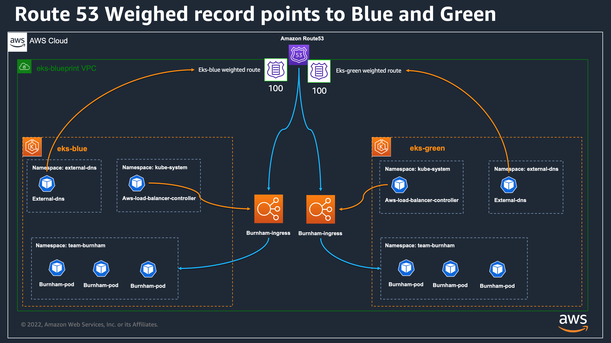

# EKS Blueprint Blue deployment

## Table of content

- [EKS Blueprint Blue deployment](#eks-blueprint-blue-deployment)
  - [Table of content](#table-of-content)
  - [Folder overview](#folder-overview)
  - [Infrastructure](#infrastructure)
  - [Infrastructure Architecture](#infrastructure-architecture)
  - [Prerequisites](#prerequisites)
  - [Usage](#usage)
  - [Cleanup](#cleanup)
- [Terraform Doc](#terraform-doc)
  - [Requirements](#requirements)
  - [Providers](#providers)
  - [Modules](#modules)
  - [Resources](#resources)
  - [Inputs](#inputs)
  - [Outputs](#outputs)

## Folder overview

This folder contains Terraform code to deploy an EKS Blueprint configured to deploy workload with ArgoCD and associated workload repository.
This cluster will be used as part of our demo defined in [principal Readme](../README.md).
What is include in this EKS cluster

## Infrastructure

The AWS resources created by the script are detailed bellow:

- The infrastructure will be deployed in the ressources created in the [core-infra stack](../core-infra/README.md)
- EKS Cluster
  - Create an EKS Managed Node Group
  - Create a platform team
  - Create applications teams (with dedicated teams quotas)
    - team-burnham
    - team-riker
    - ecsdemo-frontend
    - ecsdemo-nodejs
    - ecsdemo-crystal
  - Kubernetes addon deploy with Terraform
    - ArgoCD
      - to deploy additional addons
      - to deploy our demo workloads
      - configured to expose a service loadbalancer
  - Kubernetes addon deploy half with terraform and half with dedicated [ArgoCD addon repo]()
    - Metrics server
    - VPA
    - Aws Load Balancer Controller
    - Karpenter
    - External DNS
      - configured to target core infra Hosted Zone
  - Kubernetes workloads (defined in a dedicated github repository repository)
    - team-burnham
      - burnham-ingress configured with weighted target groups

## Infrastructure Architecture

The following diagram represents the Infrastructure architecture being deployed with this project:

<p align="center">
  
</p>

## Prerequisites

Before launching this solution please deploy the `core-infra` solution, which is provided in the root of this repository.

## Usage

**1.** Run Terraform init to download the providers and install the modules

```shell
terraform init
```

\*2.\*\* Review the terraform plan output, take a look at the changes that terraform will execute, and then apply them:

```shell
terraform plan
terraform apply
```

**2.** Once Terraform finishes the deployment open the ArgoUI Management Console And authenticate with the secret created by the core_infra stack

Retrieve the ArgoUI password

```bash
aws secretsmanager get-secret-value \
  --secret-id argocd-admin-secret.eks-blueprint \
  --query SecretString \
  --output text --region $AWS_REGION
```

Connect to the ArgoUI endpoint:

```bash
echo -n "https://"; kubectl get svc -n argocd argo-cd-argocd-server -o json | jq ".status.loadBalancer.ingress[0].hostname" -r
```

Validate the certificate issue, and login with credentials admin / <previous password from secretsmanager>

**3.** Control Access to the Burnham ingress

```bash
URL=$(echo -n "https://" ; kubectl get ing -n team-burnham burnham-ingress -o json | jq ".spec.rules[0].host" -r)
curl -s $URL | grep CLUSTER_NAME | awk -F "<span>|</span>" '{print $4}'
```

## Cleanup

See Cleanup section in main Readme.md

# Terraform Doc

<!-- BEGINNING OF PRE-COMMIT-TERRAFORM DOCS HOOK -->
## Requirements

| Name | Version |
|------|---------|
| <a name="requirement_terraform"></a> [terraform](#requirement\_terraform) | >= 1.0.1 |
| <a name="requirement_aws"></a> [aws](#requirement\_aws) | >= 3.72 |
| <a name="requirement_helm"></a> [helm](#requirement\_helm) | >= 2.4.1 |
| <a name="requirement_kubectl"></a> [kubectl](#requirement\_kubectl) | >= 1.14 |
| <a name="requirement_kubernetes"></a> [kubernetes](#requirement\_kubernetes) | >= 2.10 |

## Providers

| Name | Version |
|------|---------|
| <a name="provider_aws"></a> [aws](#provider\_aws) | >= 3.72 |

## Modules

| Name | Source | Version |
|------|--------|---------|
| <a name="module_eks_blueprints"></a> [eks\_blueprints](#module\_eks\_blueprints) | github.com/aws-ia/terraform-aws-eks-blueprints | v4.8.0 |
| <a name="module_kubernetes_addons"></a> [kubernetes\_addons](#module\_kubernetes\_addons) | /home/ubuntu/environment/eks/terraform/terraform-aws-eks-blueprints/modules/kubernetes-addons | n/a |

## Resources

| Name | Type |
|------|------|
| [aws_caller_identity.current](https://registry.terraform.io/providers/hashicorp/aws/latest/docs/data-sources/caller_identity) | data source |
| [aws_eks_cluster_auth.this](https://registry.terraform.io/providers/hashicorp/aws/latest/docs/data-sources/eks_cluster_auth) | data source |
| [aws_partition.current](https://registry.terraform.io/providers/hashicorp/aws/latest/docs/data-sources/partition) | data source |
| [aws_route53_zone.sub](https://registry.terraform.io/providers/hashicorp/aws/latest/docs/data-sources/route53_zone) | data source |
| [aws_secretsmanager_secret.arogcd](https://registry.terraform.io/providers/hashicorp/aws/latest/docs/data-sources/secretsmanager_secret) | data source |
| [aws_secretsmanager_secret_version.admin_password_version](https://registry.terraform.io/providers/hashicorp/aws/latest/docs/data-sources/secretsmanager_secret_version) | data source |
| [aws_subnets.private](https://registry.terraform.io/providers/hashicorp/aws/latest/docs/data-sources/subnets) | data source |
| [aws_vpc.vpc](https://registry.terraform.io/providers/hashicorp/aws/latest/docs/data-sources/vpc) | data source |

## Inputs

| Name | Description | Type | Default | Required |
|------|-------------|------|---------|:--------:|
| <a name="input_addons_repo_url"></a> [addons\_repo\_url](#input\_addons\_repo\_url) | Git repo URL for the ArgoCD addons deployment | `string` | `"https://github.com/aws-samples/eks-blueprints-add-ons.git"` | no |
| <a name="input_argocd_secret_manager_name_suffix"></a> [argocd\_secret\_manager\_name\_suffix](#input\_argocd\_secret\_manager\_name\_suffix) | Name of secret manager secret for ArgoCD Admin UI Password | `string` | `"argocd-admin-secret"` | no |
| <a name="input_core_stack_name"></a> [core\_stack\_name](#input\_core\_stack\_name) | The name of Core Infrastructure stack, feel free to rename it. Used for cluster and VPC names. | `string` | `"eks-blueprint"` | no |
| <a name="input_eks_admin_role_name"></a> [eks\_admin\_role\_name](#input\_eks\_admin\_role\_name) | Additional IAM role to be admin in the cluster | `string` | `""` | no |
| <a name="input_hosted_zone_name"></a> [hosted\_zone\_name](#input\_hosted\_zone\_name) | Route53 domain for the cluster. | `string` | `""` | no |
| <a name="input_iam_platform_user"></a> [iam\_platform\_user](#input\_iam\_platform\_user) | IAM user used as platform-user | `string` | `"platform-user"` | no |
| <a name="input_vpc_tag_key"></a> [vpc\_tag\_key](#input\_vpc\_tag\_key) | The tag key of the VPC and subnets | `string` | `"Name"` | no |
| <a name="input_vpc_tag_value"></a> [vpc\_tag\_value](#input\_vpc\_tag\_value) | The tag value of the VPC and subnets | `string` | `""` | no |
| <a name="input_workload_repo_path"></a> [workload\_repo\_path](#input\_workload\_repo\_path) | Git repo path in workload\_repo\_url for the ArgoCD workload deployment | `string` | `"envs/dev"` | no |
| <a name="input_workload_repo_revision"></a> [workload\_repo\_revision](#input\_workload\_repo\_revision) | Git repo revision in workload\_repo\_url for the ArgoCD workload deployment | `string` | `"main"` | no |
| <a name="input_workload_repo_url"></a> [workload\_repo\_url](#input\_workload\_repo\_url) | Git repo URL for the ArgoCD workload deployment | `string` | `"https://github.com/aws-samples/eks-blueprints-workloads.git"` | no |

## Outputs

| Name | Description |
|------|-------------|
| <a name="output_configure_kubectl"></a> [configure\_kubectl](#output\_configure\_kubectl) | Configure kubectl: make sure you're logged in with the correct AWS profile and run the following command to update your kubeconfig |
| <a name="output_eks_cluster_id"></a> [eks\_cluster\_id](#output\_eks\_cluster\_id) | The name of the EKS cluster. |
<!-- END OF PRE-COMMIT-TERRAFORM DOCS HOOK -->
